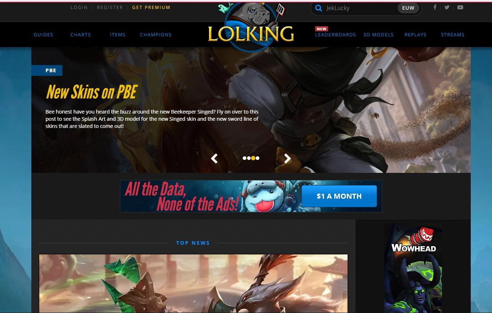
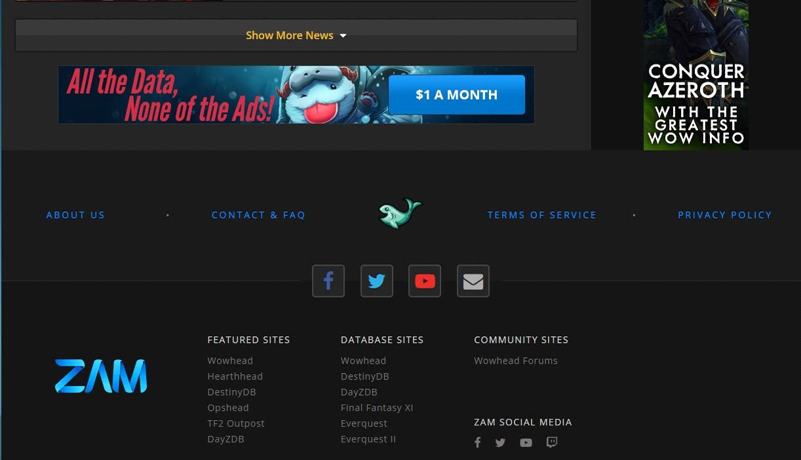
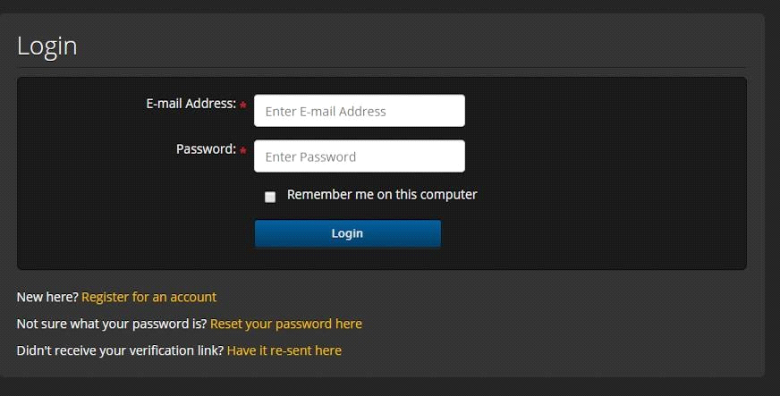
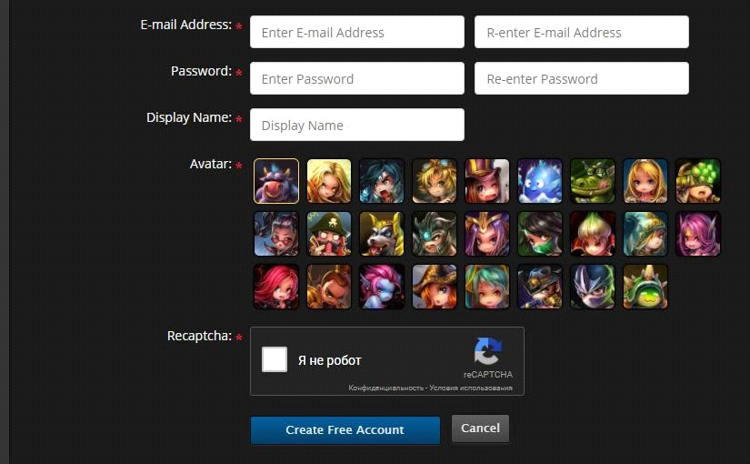
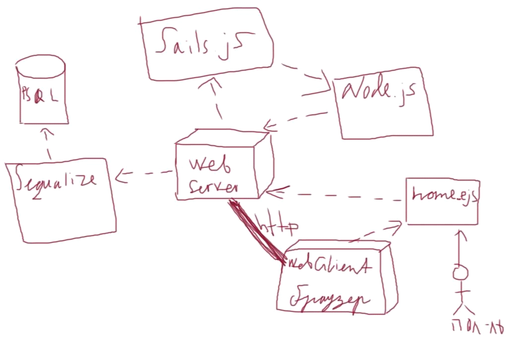

## Техническое задание на разработку интернет-сайта "LOLPRO"
### Структура документа
* Глоссарий
* Общие положения
* Требования к графическому дизайну сайта
* Функциональные требования
    * Классы пользователей
    * Требования к представлению сайта
    * Требования к разделению доступа
* Требования к видам обеспечения
    * Требования к информационному обеспечению
    * Требования к программному обеспечению
    * Архитектура системы
    * Требования к лингвистическому обеспечению
* Требования к приемке-сдаче проекта
    * Требование к документации
    * Дополнительные требования

### Глоссарий
| Термин | Определение |
| --- | --- |
| Роль | Класс пользователей системы, обладающих определенным набором прав доступа |
| Гайд | Руководство, которое помогает игроку лучше научиться играть в игру |
| Стрим | Прямая трансляция всех действий, происходящих на определенном компьютере или игровой консоли |

Прочая техническая терминология понимается в соответствии с действующими стандартами и рекомендациями международных органов, ответственных за вопросы стандартизации в сети Интернет

### Общие положения
Предметом разработки является Интернет-сайт «LOLPRO» компании «WWSFV», основанный на игре League Of Legends.

**Назначение сайта:**
* Размещение информации о событиях в игре League Of Leagends
* Предоставление статистики
* Предоставление информации о игровом процессе (чемпионы, предметы, реплеи, скины, стримы)
* Предоставление гайдов

**Цель создания сайта:**

Помощь как начинающим, так и опытным игрокам в улучшении их навыков в игре,
развитие сообщества League Of Legends

**Целевая аудитория сайта:**

Преимущественно мужчины и юноши, играющие на профессиональном	или любительском уровне.

### Требования к графическому дизайну сайта
При разработке сайта должны быть использованы преимущественно темные цветовые решения (пример дизайнерского решения сайта: http://www.lolking.net/). Разработанный дизайн предоставляется заказчику для корректировки.

### Функциональные требования
#### Классы пользователей
##### Гость - неавторизованный пользователь, обладает правами:
* Статистика - просмотр
* Новости – просмотр
* Гайды – просмотр
* Стримы – просмотр
* Чемпионы – просмотр
* Предметы – просмотр
* Видеоролики, фотографии – просмотр
* Telegram bot – общение
* Личный кабинет:
    * Регистрация на портале
    * Авторизация: ввод аутентификационных данных

##### Авторизованный пользователь, обладает правами:
* Статистика - просмотр
* Новости – просмотр
* Гайды – просмотр, создание
* Стримы – просмотр
* Чемпионы – просмотр
* Предметы – просмотр
* Реплеи – просмотр, скачиване
* Видеоролики, фотографии – просмотр
* Telegram bot – общение
* Личный кабинет:
    * Регистрация на портале
    * Авторизация: ввод аутентификационных данных

#### Требования к представлению сайта
##### Требования к представлению главной страницы сайта
Главная страница сайта должна содержать графическую часть, навигационное меню сайта, а также контентную область для последних новостей. Главная страница должна делиться на следующие разделы:
* слайдер
* главную новость (вычисляется на основе важности новости и даты )
* 6 самых последних новостей
* Кнопка для показа предыдущих новостей
* вверху страницы отображаются навигационная панель, которая обеспечивает переход к основным пунктам меню сайта, а также эмблема сайта
* ползунок для смены языка (русский, английский)
* поле поиска – предназначено для поиска статистики игрока
* поле входа на сайт для зарегистрированных пользователей или регистрации нового пользователя
* эмблемы для быстрого перехода к социальным сетям (Facebook, Youtube, Twitter)
* внизу страницы отображается поле ‘о нас’ для быстрого перехода к подробной информации о компании
* поле ‘контакты’ для перехода к контактам нашей компании
* поле ‘политика конфиденциальности’ и поле ‘соглашение пользователя’ для тех, кто любит почитать

**Все веб-интерфейсы системы должны быть адаптированы для отображения в 3 режимах:**
* "Десктопный" - для устройств, ширина экрана которых равна или превышает 1201 пикселей.
* "Планшетный" - для устройств, ширина экрана которых равна или превышает 664, но меньше 1201 пикселей.
* "Мобильный"- для устройств, ширина экрана которых меньше 664 пикселей.

* Во время работы с сайтом не должна появляться горизонтальная полоса прокрутки. При увеличенном/уменьшенном разрешении функциональные блоки расширяются/сужаются в соответсвующих пропорциях, заполняя всю рабочую область экрана браузера.

*Пример размещения элементов главной страницы：*

***

Графическая оболочка внутренних страниц (общая для всех подразделов)

Графическая оболочка внутренних страниц должна делиться на следующие разделы:
* логотип(осуществляет переход на главную страницу)
* навигационное меню сайта (навигационная панель обеспечивает переход к основным пунктам меню сайта);
* поле поиска – предназначено для поиска статистики игрока
* поле входа на сайт для зарегистрированных пользователей или регистрации нового пользователя;
* поле ‘о нас’
* поле ‘контакты’
* поле ‘политика конфиденциальности’
* поле ‘соглашение пользователя’

Шапка и подвал остаются неизменными, меняется только контентная часть отдельной страницы.

##### Авторизация
Пользователи могут авторизоваться на любой странице портала с помощью специальной формы авторизации. Форма содержит:
* Текстовое поле для ввода логина пользователя
* Кнопку отправки формы.

Данные для доступа (авторизации):

* Логин – адрес электронной почты пользователя
* Пароль – строка содержащая от 8 символов, состоящая из A-z, 0-9.

Ниже формы располагается ссылка зарегистрировать аккаунт.

При неудачной попытке авторизации – появляется приглашение для повторной попытки авторизоваться с формой авторизации.

*Пример авторизации и регистрации*

***

*Функциональные требования:*

Должна быть реализована система оповещений пользователя о важных событиях.

##### Telegram бот
Пользователи могут взаимодействовать с ботом по средством команд:
* !help
* !pickchampions
* !pickitems
* !main
* !notify

##### Требования к разделению доступа
Все опубликованные разделы сайта должны открываться для доступа на чтение без аутентификации пользователя.
При попытке входа в закрытый раздел у пользователя не прошедшего аутентификацию, должен быть запрошен логин и пароль.

### Требования к видам обеспечения
#### Требования к информационному обеспечению
##### Требования к хранению данных
Все данные сайта должны храниться в структурированном виде под управлением реляционной СУБД. Исключения составляют файлы данных, предназначенные для просмотра и скачивания (изображения, видео, документы и т.п.). Такие файлы сохраняются в файловой системе, а в БД размещаются ссылки на них.

##### Требования к языкам программирования
Для реализации интерактивных элементов клиентской части должны использоваться языки JavaScript и HTML.
Уровень back-end должен быть основан на NodeJS
Уровень front-end должен быть построен на Aurelia.js
Взаимодействие между уровнями back-end и front-end должно быть организовано посредством REST API.

##### Требования к иллюстрациям
Все рисунки должны быть в формате jpg или png или gif.

#### Требования к программному обеспечению
##### Серверная часть:
* Node.js
* СУБД PSQL
* Sequalize

##### Клиентская часть:
Любой из перечисленных ниже браузеров (указана минимальная версия) с включенным интерпретатором JavaScript:
* Mozilla 1.6 (Firefox 1.0)
* Chrome 50
* Edge

##### Архитектура системы

##### Требования к лингвистическому обеспечению
Сайт должен выполняться на английском языке.

### Требования к приемке-сдаче проекта
#### Требования к верстке страниц
html - документ должен соответствовать стандарту w3c в xHTML Strict, и быть сверстан с применением CSS.

html - документ сайта должен иметь блочную верстку (верстку div'ами), вложенные блоки следует отмечать отступами, для отступов использовать табуляцию.

html-код сайта должен быть удобен для понимания и структурирован, сложные и неоднозначные моменты прокомментированы.

Страница должна максимально идентично отображается во всех современных браузерах: Mozila FireFox 3.0 и выше, Google Chrome 50+ и на экранах любых современных устройств(компьютеров, планшетов, телефонов)

Результат требуется представить в следующей структуре файлов:
* /index.html – файл с вёрсткой страницы
* /styles.css – файл стилей сайта
* /images/ – каталог с графическими файлами дизайна сайта
* /js/ — файлы c js-скриптами.

Все названия стилей должны быть английскими (без русских слов на латинице). Все тэги должны быть написаны в нижнем регистре.

Не следует использовать на странице заголовки h2 если нет заголовка h1 (это касается всех уровней заголовков.

Для каждого информационного модуля структура документа должна соответствовать шаблонам, предоставляемым Исполнителем до начала этапа предоставления материалов.

Материалы для первоначального наполнения разделов должны быть полностью представлены Исполнителю в сроки, установленные планом-графиком работ.

Допускается передача материалов частями, в нескольких zip-файлах, соответствующих приведенным требованиям.

Передача материалов в объеме и формате, соответствующем настоящему ТЗ закрепляется подписанием Акта о передаче информационного наполнения.

#### Дополнительные требования
##### Требования к производительности

Работа любого скрипта не должна превышать 60 секунд. При условии нагрузки на сервер не более
5.000 обращений к страницам портала в сутки.

##### Требования к безопасности

Требуется разграничение доступа. Пароли пользователей хранятся в зашифрованном виде.
